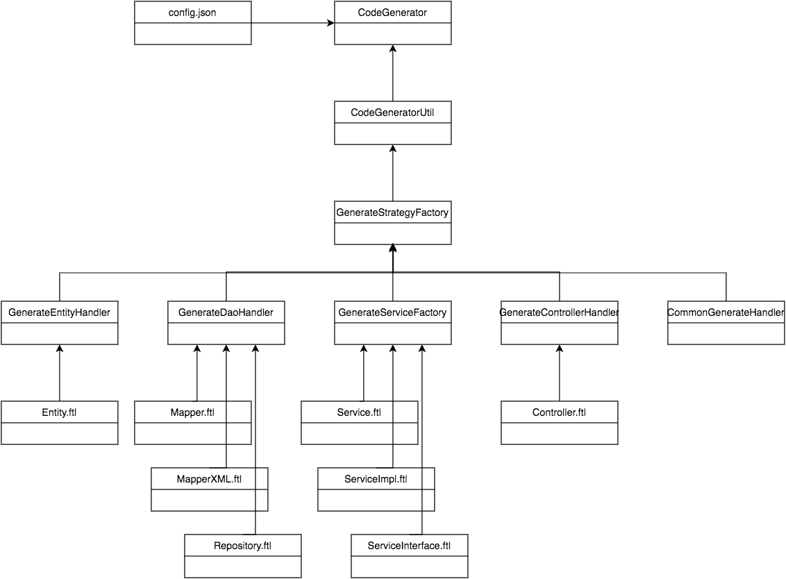

### Java web 中单表 CRUD 生成器

根据表名，生成该表的实体类，dao 层 CRUD 接口，以及相应的 service 层，controller 层接口。

### 项目类间关联图



### 使用说明

#### 1. 用法

在 /resources/config.json 中修改配置信息，执行 CodeGenerator.main() 方法生成文件。

#### 2. config.json 解释

```
{
  -- 数据库连接信息，除 tableComment 外其他皆为必填项
  "dbInfo": {
    "url": "jdbc:mysql://localhost:3306/test",
    "username": "username",
    "password": "password",
    "driver": "com.mysql.cj.jdbc.Driver",
    "dbName": "test",
    "tableName": "users",
    "tableComment": "测试-表注释"
  },

  -- 生成文件配置信息
  "generatorInfo": {
    -- 所使用的 orm 框架，目前支持 mybatis / jpa
    "orm": "mybatis", 
    "author": "jinglun",
    -- 项目在磁盘中的路径
    -- 例如我的项目分为 /com/example/demo/controller, /com/example/demo/service 层等，则这里需要指明到 /com/example/demo 目录
    "packageBaseLocation": "/Users/jinglun/Desktop/springboot-demo/src/main/java/com/example/demo",
    -- 项目包路径，依赖 packageBaseLocation，例如这个例子便是 com.example.demo
    "packageBaseName": "com.example.demo",
    -- 是否生成实体类的开关
    "generatorEntity": {
      "needGenerate": true,
      "detailPackageName": "/model"
    },
    -- 是否生成 dao 层接口的开关
    "generatorDao": {
      "needGenerate": true,
      "detailPackageName": "/mapper",
      -- mybatis 中生成 XML 文件的磁盘路径
      "mapperXMLPath": "/Users/jinglun/Desktop/springboot-demo/src/main/resources/mapper"
    },
    -- 是否生成 service 层接口的开关
    "generatorService": {
      "needGenerate": true,
      "detailPackageName": "/service"
      -- service 层代码模式：单单实现类，还是需要接口及其实现类
      "interfaceMode": false
    },
    -- 是否生成 controller 层接口的开关
    "generatorController": {
      "needGenerate": true,
      "detailPackageName": "/controller",
      -- controller 层接口的统一路由前缀
      "mappingUrl": "/demo"
    }
  },

  -- 插件配置相关信息，例如是否需要生成 swagger 注解，lombok 注解等
  "pluginInfo": {
    "needSwagger": false,
    "needLombok": false
  }
}
```

#### 3. 实现功能

1. [x] 支持 MySQL 数据源
2. [x] 支持 mybatis / jpa
3. [x] 支持 service 层接口实现类模式或直接实现类模式
4. [x] 支持 swagger / lombok 注解配置信息
5. [x] 支持配置文件中不存在的文件夹时自动创建文件夹
6. [x] 支持自定义对象的生成（ApiResult）

#### 4. TODO list

1. [ ] 支持多数据源
2. [ ] 代码优化